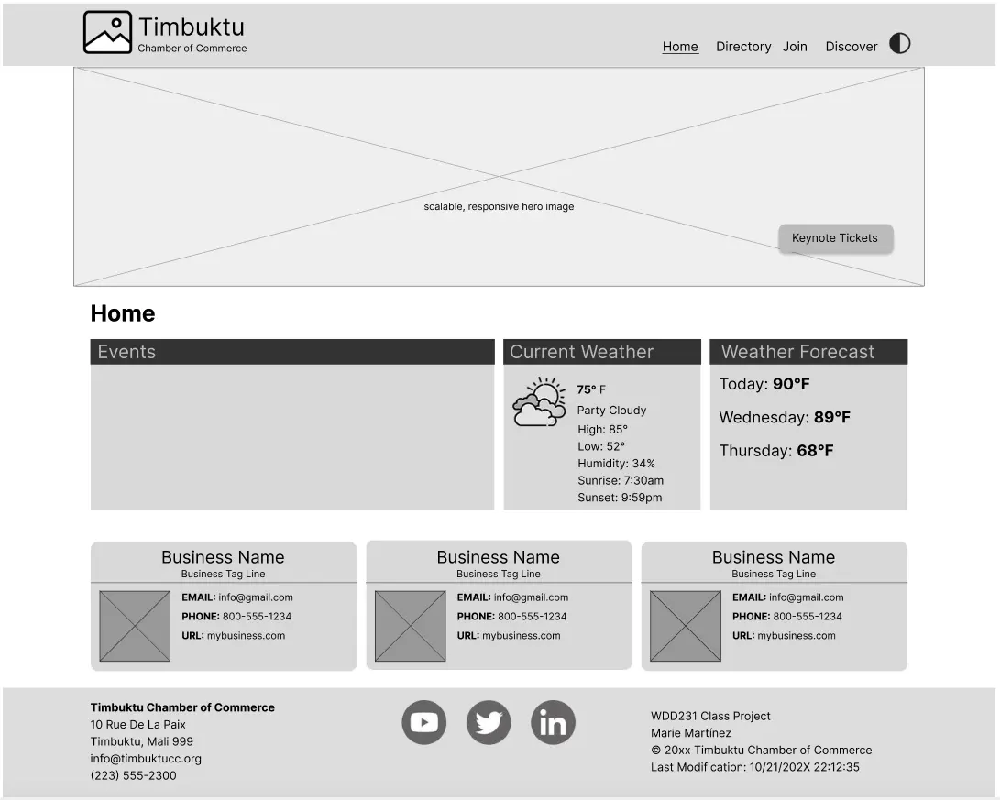
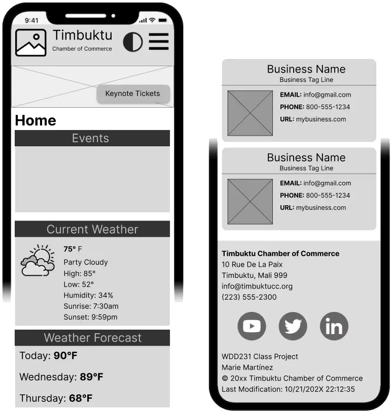

# Site Name
Pernambuco Chamber of Commerce

# Site Purpose
This website will serve as a resource hub for businesses in the State Of Pernambuco. The site will provide information on local events, host networking opportunities, create business directories, and encourage local shopping. It aims to promote local economic growth, support local businesses, and foster a sense of community between the businesses.

# Target Market
Business owners and patrons in the State Of Pernambuco

# Site Goals
- Improve member engagement by providing valuable resources and networking opportunities.
- Attract new businesses and encourage economic development in the community.
- Improve the visibility and reputation of the chamber as a trusted authority in local business matters.
# User Personas
- <strong>Small Business Owner:</strong> Maria is a 35-year-old entrepreneur who owns a small boutique shop in town. She is looking for networking opportunities, business resources, and marketing support to help grow her business.

- <strong>Corporate Executive:</strong> Diego is a 47-year-old executive at a large company looking for growth opportunities. His company is interested in partnership opportunities, economic development resources, and networking with other business leaders in the area

- <strong>The New Resident:</strong> Francisco recently moved into the community and is looking to learn more about services available in the area. He is interested in finding business directories, event calendars, and community service opportunities.

# Scenarios

- A local business owner is interested in joining the chamber of commerce to network with other business owners. They visit the website to find information on membership benefits, fees, and how to apply.
- A community member is looking for upcoming events and workshops hosted by the chamber. They visit the website to browse the events calendar and register for interesting activities.
- A visitor from out of town is considering relocating to the area and wants to learn more about the local business environment. They explore the chamber's website for information on existing businesses, availability of skilled labor, and quality of life in the area.

# SEO Plan
- Use relevant keywords in site descriptions, content, and blog posts.
- Verify the site on Google’s Business Profile.
- Get inbound links or backlinks from all member business to improve rankings.
- Embed Google Analytics in all site pages.
# Design Brief
- --blue: #0568A6;
- --light-blue: #C2E0F2;
- --yellow:#F2B705;
- --orange: #BF5B04;
- --red: #A61A0D;
- --white: #f4f4f4;
- --black: #3b3b3b;
- Font Family <strong> Poppins </strong>

# Site Map

Chamber Site Map
## Wireframes
### Desktop

Chamber Desktop Wireframe

### Mobile

Chamber Mobile Wireframe

